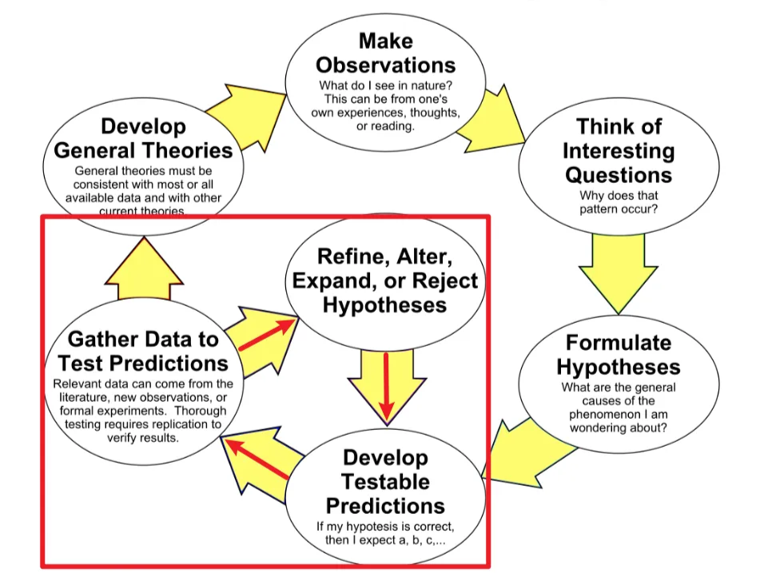
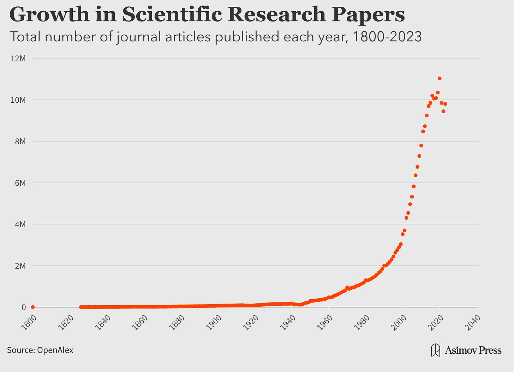
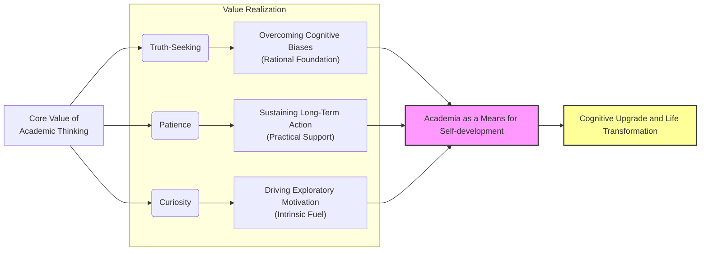

I’m not a scholar. I’ve been to grad school, so at most I can call myself a researcher. After graduation, my work had nothing to do with academic research. But the training I went through as a student—the methods, the way of thinking—has shaped me ever since. Because of that, I’ve kept my interest in scholarship alive. I still read academic work from time to time.

I’m not writing this piece to dive into one subject or to analyze a specific field. Instead, I want to explain why I’ve chosen to keep a space for scholarship in my life, **seeing it as a means rather than an end in itself**.

Looking back, I’ve realized there are three reasons I enjoy it so much: **truth-seeking, patience, and curiosity**. Let me go through them one by one.

## Truth-Seeking

For me, truth-seeking happens on two levels: basic and advanced.

The basic level is simply about making sure facts and data are accurate. The advanced level is harder—it’s about resisting the urge to fool yourself by picking only the facts that favor your side. Most people can manage the first if they try. But the second takes real discipline and training.

I didn’t even know about that advanced level until grad school. While preparing to publish my thesis, I watched lectures on research ethics and dug into the [scientific method](https://en.wikipedia.org/wiki/Scientific_method). From then on, I could no longer stomach fake or sloppy research—and more importantly, I could no longer lie to myself.

Take student research as an example. Many students, without proper training, make a common mistake: they start with a conclusion in mind, then gather evidence to back it up. That’s not how serious scholarship works. **Real research begins with a hypothesis, then hunts for evidence. If the evidence supports it, you accept it—at least for now. If not, you drop it or reshape it and build a new one** (as shown below as [The Scientific Method as an Ongoing Process](https://en.m.wikipedia.org/wiki/File:The_Scientific_Method_as_an_Ongoing_Process.svg)).

    
    
The Scientific Method as an Ongoing Process

[Hu Shih](https://en.wikipedia.org/wiki/Hu_Shih) once summed up a research approach with the phrase: *"Make bold hypotheses, and verify them carefully."* [^1] I agree with his point, but I also see its limits. His idea of “verification” stops at the basic level of truth-seeking—making sure facts and data are accurate. What it doesn’t fully capture is the advanced level of truth-seeking, which is at the very core of the scientific method in serious scholarship.

Reflecting on my own experience, during my thesis, I was in no position to risk academic misconduct such as data fabrication (thus meeting the basic truth-seeking). I rewrote my hypothesis three times over six months. Each time, the evidence proved my old idea wrong, I had to accept the reality, drop it, and start over. Although this process was time-consuming and arduous, it gave me a solid foundation in the value of truth-seeking. Later, when I read Ray Dalio’s principle “[Embrace Reality and Deal with It](https://www.principles.com/principles/8b086563-5bb4-4741-8713-c62bd1a0d749/),” I realized I had already learned that lesson in grad school.

This mindset has shaped the way I look at the world. For example, think about the “information cocoon” created by online platforms such as Google, TikTok, and Weibo. Algorithms feed us what we like, so we see more of the same. That’s troubling enough. But even worse is when people build their own cocoons.

Take a recent example: under the long influence of certain information environments, some people gradually come to believe that [Japan’s discharge of radioactive water of the Fukushima Daiichi Nuclear Power Plant](https://en.wikipedia.org/wiki/Discharge_of_radioactive_water_of_the_Fukushima_Daiichi_Nuclear_Power_Plant#:~:text=Radioactive%20water%20from%20the%20Fukushima,the%20Tōhoku%20earthquake%20and%20tsunami.) must be harmful. Once they lock onto that belief, they don’t search “Is the discharge harmful?” Instead, they type in “How harmful is it?”—hunting only for evidence that confirms what they already think. That’s not truth-seeking; that’s self-deception: the conclusion comes first, the evidence second.

Fortunately, with a truth-seeking mindset shaped by my academic training, I would ask first: is it really harmful? If yes, then I would ask, how harmful?  That one extra step makes all the difference.

Another powerful tool in advanced truth-seeking is [counterfactual reasoning](https://www.sciencedirect.com/topics/computer-science/counterfactual-reasoning#:~:text=Counterfactual%20reasoning%20refers%20to%20the,decision%20theory%20and%20game%20theory.), widely used in social science research. In plain terms, it means drawing causal inferences by comparing what actually happened with what might have happened if a certain factor had been absent. For example:

> Fact: After a certain policy was introduced, wages increased.
>
> **Counterfactual:** If the policy had not been introduced, would wages still have increased?

Only by making comparisons like this can we get closer to the true impact of a policy. Think about it: if we don’t apply this kind of reasoning in our daily choices, we risk exaggerating the role of some factors while missing the real causes. In a sense, without this habit of thought, it’s impossible to fully understand the world.

After these experiences, truth-seeking has become central to me. And once this mindset takes root, it feels irreversible. It’s like putting on glasses—once you see clearly, you can’t pretend to be satisfied with the blur.

## Patience

Truth-seeking comes at a cost, one of which is patience.  

Before I entered grad school, a senior PhD student once told me, "Academic work means sitting on a cold bench[^2]." He was right. You can’t uncover meaningful truth overnight. Picture opening a sealed box and finding three pieces of chocolate inside. That is technically a form of truth-seeking, but it requires almost no patience. It’s too simple, too trivial. Academic research is different. Meaningful discoveries rarely come so easily. They demand long stretches of study and persistence.

Good research is always built on what came before. And if you want to stand on someone else’s shoulders, you first have to climb up there—forget about leaping straight to the top. Human knowledge has piled up for centuries, and in our generation it has exploded. You can see it in the surge of scientific research papers since the 1800s, or in the rapid pace of new technology over just the past twenty years. **In almost every field, others have already dug deep. That means the only way forward is to absorb what has been done before us. Only then can we create something new, and do it with real meaning and efficiency**. As [Su Shi](https://en.wikipedia.org/wiki/Su_Shi) once wrote: *“Study widely, choose wisely; build up steadily, release gradually.”*[^3]

    
    

On a side note, this explosion of knowledge has changed our daily lives in ways that are hard to ignore. Anyone who has lived in China over the past thirty years has seen it firsthand. That’s why I peronally find it hard to understand those who enjoy the fruits of human progress yet still sigh that "the world is going downhill." If you zoom out far enough, it’s clear: we are already living in the best of times.

Back to my own story. I wasn’t from a scholarly family, nor was I gifted with any special "buff." On top of that, the pandemic hit, so I never once met my supervisors in person to discuss my research. Most of the time I sat alone in my apartment, combing through past studies, taking notes, and trying to make sense of it all. This process lasted nearly a year before I managed to publish. Looking back, it wasn’t talent or even method that carried me through. It was patience.

From this perspective, **patience matters more than talent, and persistence matters more than method**. If you keep at it long enough, even when you start off on the wrong track, sooner or later you’ll notice what doesn’t feel right, and you’ll naturally adjust your approach. But if I hadn’t started my literature review in the first place, or if I had quit halfway through, there would have been no method to refine at all. Isn’t that the truth?

This lesson extends beyond research. Take running, for example. A while ago I started running without much thought, just to move. After two months, my calves began to hurt. Only then did I realize my method might be off. That pain pushed me to study better running form. The key point is this: **if I hadn’t kept running patiently, I never would have noticed the problem, let alone corrected it**. Some may ask, "Why not learn the right method first, then start?" But even the best method works differently for different people. And more importantly, none of us have the time to prepare everything perfectly before we act. Think about it: how many times have you waited until you felt "fully ready" to start something, only to never start at all? Better to begin patiently, adjust as you go, and let persistence do the rest.

That’s why I believe in "[learning by doing](https://en.wikipedia.org/wiki/Learning-by-doing) (LBD)," but with one crucial addition—**learning by *constant* doing** (LB**C**D). Trial and error only pay off when you stick with the process long enough for problems to surface and improvements to take root.

In the end, my time in research gave me far more than a degree or a published paper. It taught me patience with people and problems. And for that, I’m deeply grateful to the version of myself who didn’t give up.

## Curiosity

Truth-seeking and patience naturally spark curiosity. And curiosity, in turn, fuels them both. I believe that’s why so many great scholars devote their lives to research—they’re simply too curious to stop.

Curiosity is impossible to hide. In fact, once you start digging, it grows stronger and creates a feedback loop that pulls you deeper into discovery. Take Professor [Shiping Tang](https://scholar.google.com/citations?user=AochAlcAAAAJ&hl=en) of Fudan University. Since 1997, he has published more than 90 papers spanning international relations, political science, economics and development studies, philosophy of social science, and even interdisciplinary work in biology and data science. I don’t believe he produced such a wide range of work just to meet professional requirements. That level of output is almost certainly driven by relentless curiosity. For scholars like him, the so-called “cold bench” of academic research isn’t cold at all—it’s warmed by daily use, even to the point of being hot.

I experienced a smaller version of this myself. During graduate school, I kept reading because I needed to finish my thesis. But when the thesis was finally done, the habit didn’t stop. My inner drive to explore only grew stronger. Soon I found myself curious about fields far beyond my major, which eventually led me to a career that had nothing to do with what I studied in school.

After graduation, as I met more people, I noticed something that surprised me: many people no longer feel genuine curiosity about the world. They may ask questions now and then, but they rarely take the next step to investigate. Some don’t even bother to google it, dismissing it as pointless. I find that hard to understand. **Even if the only outcome is keeping alive the little curiosity we still have, isn’t that already worthwhile?** To me, it is. Giving up on curiosity means giving up on one of the most basic human strengths.

A line from the Japanese drama *The Queen’s Classroom* captured this perfectly:

> **「好奇心を失った瞬間、人間は死んだも同然です。」**(The moment you lose curiosity, you’re as good as dead.)

It may sound harsh, but it’s true. Curiosity is the root of self-directed learning, and learning has the power to transform lives. Without curiosity, people don’t feel like learning. Without learning, they never see the benefits of learning. Without those benefits, their curiosity shrinks even further... And so the cycle goes, spiraling downward.

## Conclusion

For these three reasons, truth-seeking, patience, and curiosity, I’ve chosen to keep a space for scholarship in my life. It doesn’t have to be scholarship, strictly speaking. Anything that sparks these three qualities is worth keeping. But for me, it was scholarship that taught them, shaped them, and made them part of who I am. That’s why it will always have a place in my life.

**This article was refined with the support of AI.*

[^1]: Hu Shih. *The Methodology of Qing Dynasty Scholars* (清代学者的治学方法). 1912. Available at [Wikisource](https://zh.wikisource.org/wiki/清代学者的治学方法). 
[^2]: "坐冷板凳" (literally ”sitting on a cold bench“) is a Chinese idiom that refers to enduring long periods of hard work or waiting without immediate recognition or reward.
[^3]: Su Shi. 稼说 (送张琥). Available at [Wikisource](https://zh.wikisource.org/zh-hans/稼說（送張琥）).

