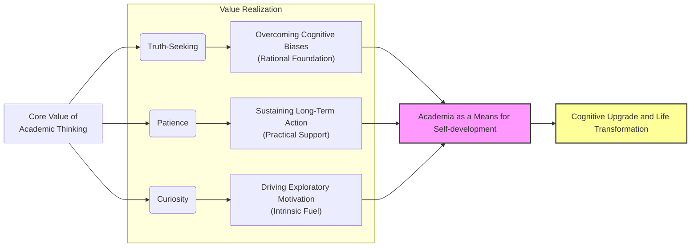

I’m not a scholar. I’ve been to grad school, so at most I can call myself a researcher. After graduation, my work had nothing to do with academic research. But the training I went through as a student—the methods, the way of thinking—has shaped me ever since. Because of that, I’ve kept my interest in scholarship alive. I still read academic work from time to time.

I’m not writing this piece to dive into one subject or to analyze a specific field. Instead, I want to explain why I’ve chosen to keep a space for scholarship in my life, **seeing it as a means rather than an end in itself**.

Looking back, I’ve realized there are three reasons I enjoy it so much: **truth-seeking, patience, and curiosity**. Let me go through them one by one.

## Truth-Seeking

For me, truth-seeking happens on two levels: basic and advanced.

The basic level is simply about making sure facts and data are accurate. The advanced level is harder—it’s about resisting the urge to fool yourself by picking only the facts that favor your side. Most people can manage the first if they try. But the second takes real discipline and training.

I didn’t even know about that advanced level until grad school. While preparing to publish my thesis, I watched lectures on research ethics and dug into the [scientific method](https://en.wikipedia.org/wiki/Scientific_method). From then on, I could no longer stomach fake or sloppy research—and more importantly, I could no longer lie to myself.

Take student research as an example. Many students, without proper training, make a common mistake: they start with a conclusion in mind, then gather evidence to back it up. That’s not how serious scholarship works. **Real research begins with a hypothesis, then hunts for evidence. If the evidence supports it, you accept it—at least for now. If not, you drop it or reshape it and build a new one** (as shown below as [The Scientific Method as an Ongoing Process](https://en.m.wikipedia.org/wiki/File:The_Scientific_Method_as_an_Ongoing_Process.svg)).

    
    
The Scientific Method as an Ongoing Process

[Hu Shih](https://en.wikipedia.org/wiki/Hu_Shih) once summed up a research approach with the phrase: *“Make bold hypotheses, and verify them carefully.”*[^2] I agree with his point, but I also see its limits. His idea of “verification” stops at the basic level of truth-seeking—making sure facts and data are accurate. What it doesn’t fully capture is the advanced level of truth-seeking, which is at the very core of the scientific method in serious scholarship.

Reflecting on my own experience, during my thesis, I was in no position to risk academic misconduct such as data fabrication (thus meeting the basic truth-seeking). I rewrote my hypothesis three times over six months. Each time, the evidence proved my old idea wrong, I had to accept the reality, drop it, and start over. Although this process was time-consuming and arduous, it gave me a solid foundation in the value of truth-seeking. Later, when I read Ray Dalio’s principle “[Embrace Reality and Deal with It](https://www.principles.com/principles/8b086563-5bb4-4741-8713-c62bd1a0d749/),” I realized I had already learned that lesson in grad school.

This mindset has shaped the way I look at the world. For example, think about the “information cocoon” created by online platforms such as Google, TikTok, and Weibo. Algorithms feed us what we like, so we see more of the same. That’s troubling enough. But even worse is when people build their own cocoons.

Take a recent example: under the long influence of certain information environments, some people gradually come to believe that Japan’s discharge of radioactive water of the Fukushima Daiichi Nuclear Power Plant must be harmful. Once they lock onto that belief, they don’t search “Is the release harmful?” Instead, they type in “How harmful is it?”—hunting only for evidence that confirms what they already think. That’s not truth-seeking; that’s self-deception: the conclusion comes first, the evidence second.

Fortunately, with a truth-seeking mindset shaped by my academic training, I approached it differently. I first asked, “Is it harmful at all?” Only if the answer was yes would I then ask, “How harmful?” At first glance, it’s just one extra step. In reality, it changes everything.

Furthermore, the [Counterfactual reasoning](https://www.sciencedirect.com/topics/computer-science/counterfactual-reasoning#:~:text=Counterfactual%20reasoning%20refers%20to%20the,decision%20theory%20and%20game%20theory.)—a tool commonly used in research—is also a powerful asset in advanced truth-seeking. In short, scholars make causal inferences by comparing scenarios with and without a particular variable. For example:

> Fact: After a certain policy was implemented, wages increased.
>
> **Counterfactual reasoning:** If the policy had not been implemented, would wages still have increased?

Only by making such comparisons can we more accurately deduce the true impact of a policy. Reflect on this: if we don’t adopt this truth-seeking approach in our everyday decisions, we might overestimate the importance of certain factors while overlooking genuine causal relationships. It could even be said that without this kind of thinking, it is impossible to fully understand the world.

After all these experiences, the pursuit of truth has become immensely important to me. Moreover, once this way of thinking is established, it seems irreversible—much like how, once we’ve breathed fresh air, we can no longer tolerate smog.

## Patience

The pursuit of truth comes at a cost—one of which is patience. I remember that before I entered graduate school, a doctoral candidate told me, “In academia, you must be prepared to sit on a cold bench[^1].”

Meaningful truth-seeking is rarely achieved overnight. Discovering a “black box” that, say, contains three pieces of chocolate may also be a form of truth-seeking—but it hardly requires any patience and seems trivial or simplistic. In academic research, it’s even more so; excellent work is built on the shoulders of those who came before. Since one must stand on those shoulders, one first has to climb up—forget about leaping straight to the top. After all, the accumulated intellectual achievements of humanity over centuries have finally exploded in our generation (as shown in the chart below, which illustrates the annual increase in journal articles published from 1800 to 2023). From personal experience, the rapid pace of technological advancements and products updates in the last two decades further supports this notion. **In nearly every field, our predecessors have conducted deep and profound research, and only by first accumulating and studying can one create something meaningful and efficient—there is no other way.** The Chinese ancient saying, “[Observe broadly and select sparingly; accumulate extensively and release sparingly](https://zh.wikisource.org/zh-hans/稼說（送張琥）),” perfectly captures this idea.

    
    

On a side note, this explosion of intellectual achievement has undeniably brought about earth-shattering changes in our lives. Anyone who has lived in China over the past thirty years can attest to these profound transformations. Personally, I find it hard to understand those who, while enjoying the tangible benefits of human intellectual progress, still lament the decay of society. In fact, when viewed over a long stretch of time, we are indeed living in “the best of times.”

Getting back on track, I am not from an academic family, and before graduate school I never received any rigorous academic training—so I naturally lacked any innate talent or academic background. Moreover, due to the pandemic, I never had the opportunity to discuss research topics or methods face-to-face with my supervisor. Most of my time was spent in my apartment poring over and reviewing the work of others, summarizing and learning from their research findings and approaches. This process lasted about a year, and eventually, I published my own paper. In this sense, **patience is more important than talent, and persistence matters more than specific methods**. As long as we have the patience to stick with something, even if we start off on the wrong foot, we will eventually notice when something is amiss and be able to identify and refine our methods. But if I had never begun that literature review—or had given up partway through—then there would be no method to speak of. Wouldn’t you agree?

In addition, I recently took up running—the kind where you just start without much thought. After about two months, I noticed some soreness in my calf muscles and realized that my approach might be flawed. So, I began learning a running method that suited me. The key point here is that **if I am not patient enough to keep going, I won’t have the opportunity to discover the problem and refine my method**. Some might ask, “Why not learn the proper method first before taking action?” First of all, even the most scientifically proven method can vary in effectiveness from person to person. More importantly, we don’t have endless time to prepare perfectly for everything. Think about it—how many times have you postponed action, insisting on being “perfectly prepared,” only to end up doing nothing? Just be patient and take action. I advocate a [learning-by-doing](https://en.wikipedia.org/wiki/Learning-by-doing) approach (LBD), but I believe that “learning by **constant** doing” (LB**C**D) is the ultimate path.

In short, my academic experiences have greatly enhanced my patience toward both people and situations. I am deeply grateful to my past self for persevering, because I have gained something far more valuable than merely a degree or published papers.

## Curiosity

In the process of doing academic work, under the dual influence of the pursuit of truth and patience, curiosity is naturally triggered in a cycle, which in turn feeds back into and strengthens the former two qualities. I believe this is why so many outstanding scholars dedicate their lives to researching specific fields: they are simply too curious. 

Curiosity, it seems, cannot be suppressed. In fact, as one continues to engage in research, this curiosity is continually fueled, creating a positive feedback loop that compels one to explore ever-new unknowns. For example, just on Google Scholar, Professor Shiping Tang of Fudan University has published over 90 papers between 1997 and 2025, spanning disciplines such as international relations, political science, economics, social theory and philosophy, evolutionary theory and psychology, biological sciences, data science, public health, and infectious disease research. I personally don't believe that Professor Tang’s interdisciplinary output was driven solely by work requirements—his insatiable curiosity about the world must have played a significant role. In this light, for many outstanding scholars, their “bench” never grows cold; indeed, being there day in and day out, it has become remarkably “warm.”

I, too, was driven by curiosity in my own research field during graduate school, constantly reading and exploring. Initially, it was all for the sake of publishing papers, but once I completed that task, my inner urge to explore could not be quenched. Moreover, this curiosity about the unknown quickly spread, prompting me to continuously venture into new fields, learn new things, and ultimately choose a career entirely unrelated to my original area of study.

After graduation, as I came into contact with more people, I noticed that many seemed to have lost their curiosity about the world. They might occasionally ask questions about their surroundings, but that’s about it—there’s little drive to delve deeper or even “Google it,” because they believe it’s of no use. I find this hard to understand—**even from the perspective of nurturing one's limited curiosity, it’s still very useful!** In the Japanese drama *The Queen’s Classroom*, the protagonist Yūki Amami once remarked in response to a student’s question:

> **「好奇心を失った瞬間、人間は死んだも同然です。」**(The moment one loses their curiosity, it’s as if one is dead.)

With that in mind, how can we afford to neglect our curiosity? After all, curiosity is the foundation of proactive learning, and learning new knowledge can profoundly transform one’s life. Yet, those who lack curiosity rarely seek to learn, and those who don’t learn can never experience the benefits of learning. As a result, they continue not to learn, continue not experiencing the benefits of learning, and their curiosity continues to wither… and so the cycle continues.

## Conclusion

Based on these three pillars, I have chosen to preserve academia within my heart. Actually, this doesn't need to be limited solely to academic pursuits—academia has played an important role in my life and has enriched me, so it occupies a special place in my heart. In fact, any worthy pursuit that can evoke these three qualities deserves its own dedicated space within us.

**This article was written with the support of AI.*

[^1]: "坐冷板凳" (literally ”sitting on a cold bench“) is a Chinese idiom that refers to enduring long periods of hard work or waiting without immediate recognition or reward.
[^2]: Hu Shih, *The Methodology of Qing Dynasty Scholars [清代学者的治学方法]* (1912). Available at [Wikisource](https://zh.wikisource.org/wiki/清代学者的治学方法).

