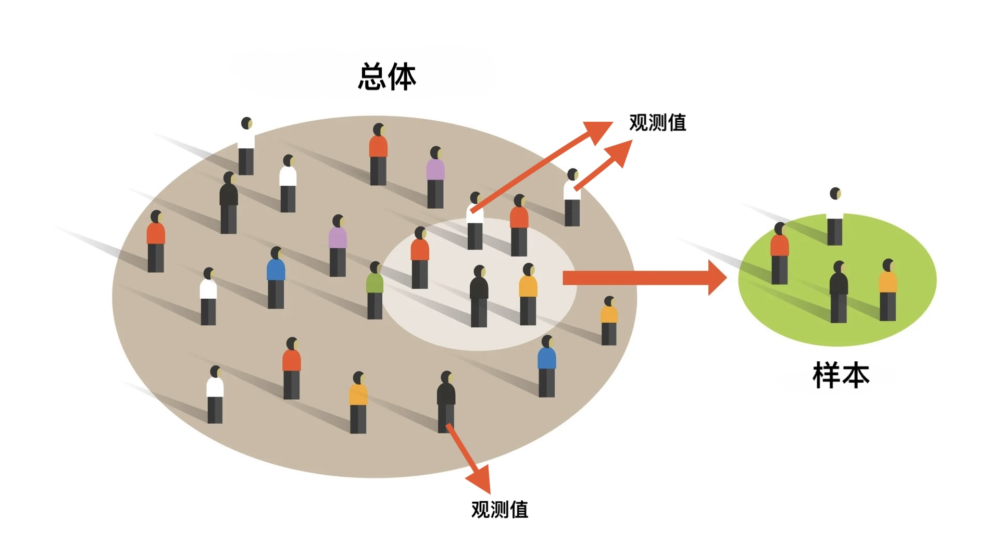
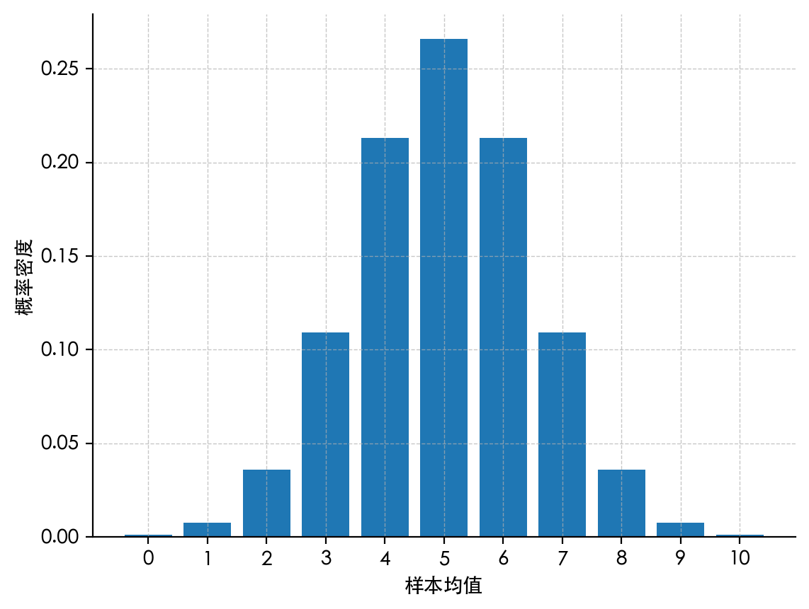
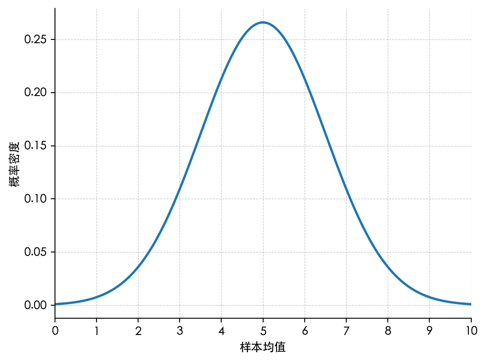
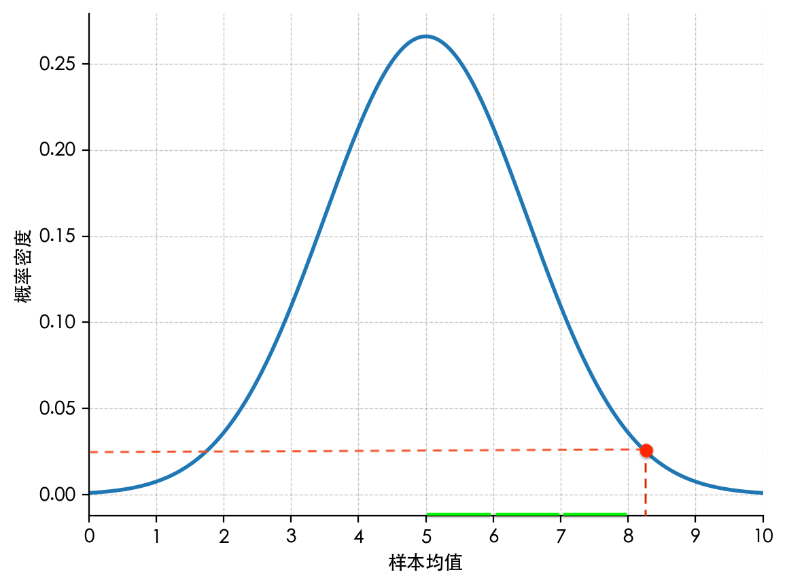
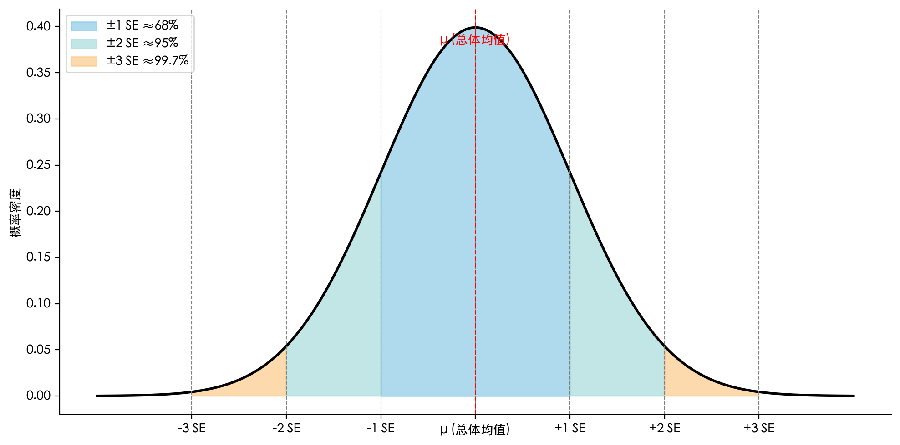
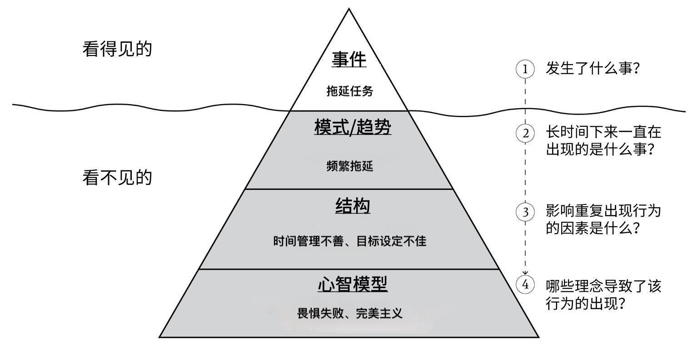
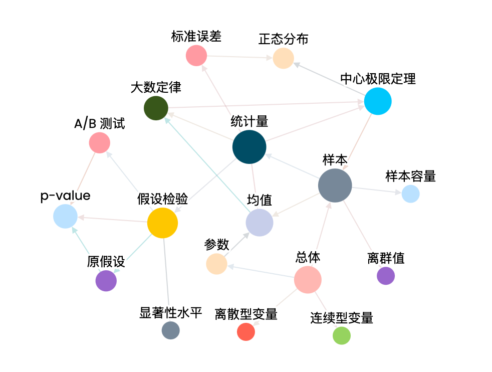

读研的时候，我面对的最难解的问题有两个：1）什么是国际关系学科；2）什么是 *p*-value。

关于第一个问题，我写过[一篇文章](https://shaodong.name/2024/04/25/ir-in-social-science/)，暂时得到了满意的答案。更重要的是，文章不仅介绍了国际关系，更讨论了“什么是科学”。

可对于第二个问题，我却迟迟未动笔，因为我始终觉得，“什么是 *p*-value”这个问题的背后，还有一些东西我没搞明白——但这事我绝对没忘。

今天，终于写下这篇文章。这篇文章当然也不会只回答这个问题，否则轮不到我来写。简中互联网上关于“到底什么是 *p*-value”的文章不计其数。我写这篇文章的目的是，讲清楚“系统性学习“这件事。

“系统性学习”指的是，**在认识到知识系统存在的前提下，通过持续探索构建知识网络，将各概念相互关联并不断验证、优化，直至形成一个完整可用的体系的学习过程**。

尝试回答“到底什么是 *p*-value”的过程，就是阐明“系统性学习”的绝佳范例。想理解什么是 *p*-value，单独考察它本身是绝对不够的。你一定查到过关于 *p*-value 的定义，比如:

> *p*-value 指的是在假设检验中，原假设成立的前提下，观测到“当前样本结果或更极端结果”出现的概率。

可你大概率看完后还是一头雾水——每一个词都很熟悉，组合在一起就不知所云，更别提理解 `p < 0.05` 的含义。随后，陷入一种“略知一二”的状态。更可怕的是，这种“懂一点”的错觉，会让你**感觉**自己理解了这个概念，然后一直糊里糊涂下去……实际上， *p*-value 这个概念并不是作为一个孤立的知识点存在，而是统计知识网络的一部分。要理解它，你必须对整个系统的知识有清晰的把握。

    
    

如此看来，系统性学习其实也没什么新奇的，无非就是“打破砂锅问到底”：**学习过程中遇到不懂的随时查明，并汇总到已有的知识网络中，直到所有的节点都清晰准确地链接在一起。**

让我们开始罢。

## 基本概念

任何东西都是有成本的，学习也是。花时间去理解那些最基础的底层概念就是学习的成本——你没有任何办法回避它们。就像我们学中文要先学拼音、学英语要先认字母、学日语要先背假名。

基础概念每一个看上去都很简单，但是组合在一起就会变成让人困惑的复杂概念。 因为一时偷懒，没有投入足够的时间和精力去深入理解基础概念，往往导致始终难以掌握复杂概念的结果。

下面这些基础概念就是你为了搞清楚“到底什么是 *p*-value”所要付出的成本——你没有任何办法回避它们，必须完全掌握才能继续。如果你发现这些定义与其他资料略有差异，这很正常，无需纠结。它们都是我用 ChatGPT 生成的，仅用来与接下来的讲解对照参考，如果你手头有更易理解的权威说法，请优先参考。

> - 样本（Sample）：从总体中抽取的一部分观测值或实验对象，用来推断或描述总体的特征。
> - 样本容量（Sample size）：样本中观测值（或实验对象）的数量。 
> - 总体（Population）： 研究对象的全体个体或全部观测值的集合，是我们想要了解其特征的整体。
> - 参数（Parameter）：描述总体特征的数值，如总体均值、总体方差等。参数通常是未知的，需要通过样本估计。
> - 均值（Mean）：一组数据的平均数，等于所有观测值之和除以观测值的个数。
> - 统计量（Statistic）：由样本数据计算得到的、用于描述或推断总体参数的数值。包括，样本均值、样本中位数、样本方差等

想象你往一锅水里加入盐并搅拌均匀，然后用勺子舀出多次盐水来尝咸淡。整锅盐水就是我们的**总体。**你每舀出的一勺盐水的咸度是一次**观测值**；你共舀了多少勺（例如 30 勺或 50 勺）的集合是一个**样本**，对应的勺数就是**样本容量**。因为每勺都是取自同一锅盐水，凭经验来说，它们的平均咸度应该跟总体咸度差不多吧（否则你就要反思下，自己一直以来为什么要在做饭时不停地“取样”尝味道了）？把所有**观测值**求和后除以样本容量，得到的就是**样本均值**，它是一个**统计量**。我们用它来估计整锅盐水的**总体均值**（**参数**）。

    
    
总体与样本

掌握这些概念后，我们就可以理解统计学[^7]的核心使命：**通过样本来推断总体，即统计推断**。为此，最重要的前提是确保**样本具有代表性**，也就是让样本统计量与总体参数尽量一致。放在盐水例子里来说就是，你舀的那几勺得能代表这整锅盐水，不能只舀上面或者只舀下面；其次，就算代表性过关，你尝到的咸度跟整锅的真实咸度多少会有点差别，这就是**误差**。因为，样本始终只是总体的一部分，永远不可能完全等同于总体，误差必然存在。为了更可靠地推断总体特征，统计学需要衡量这个误差。

基于上述统计学的核心使命，我们可以归纳出两条基本要求：

1. **样本必须具有代表性。**
2. **样本一定存在误差，为了提高推断的可靠性，必须对这种误差进行量化。**

接下来顺理成章的问题就是：我们怎样来满足这两条基本要求呢？

## 理论基础

大数定律和中心极限定理正是解决“代表性”和“误差量化”两大问题的理论基础，整个统计学体系都建立在它们之上。

### 大数定律

大数定律告诉我们：**随着样本容量的增大，一次取样算出的“样本均值”会越来越接近总体均值，因此估计也就越可靠**。可以想像，在我们的盐水例子中，如果只舀 5 勺盐水来算平均咸度，结果可能波动较大，但如果舀 50 勺，算出来的平均咸度就更可能接近整锅盐水的真实咸度。

### 中心极限定理

中心极限定理告诉我们：**当每次都取足够多的样本（即样本容量足够大）并多次重复独立取样后，得到的样本均值的分布会呈现“钟形曲线”，即正态分布**，这为我们量化误差提供了理论依据。

如果刚刚你脑海中闪过“什么是正态分布来着? 如何量化误差？”这样的想法，就说明你渐渐明白问题出在哪里了。你看，我们又发现了一个一知半解的概念，它阻碍着我们对 *p*-value 的理解。那么还是耐心来吧？

#### 正态分布

再回到那锅盐水。想象一下，假设整锅盐水（总体）的咸度为 5。如果进行**无限次取样**，每次都舀 n 勺盐水算一个平均咸度，凭直觉来说，平均咸度几乎是5的情况应该是最常见的。4 偶尔出现，3 以下就不太可能了——目前是淡了的情况。有没有偏咸情况呢？当然有可能。所以，6 也偶尔出现，7 以上就不太可能了。如果把这些平均咸度画成图，x 轴是咸度刻度（0[^1]、1、2、3…10），y 轴是出现频率， 大概就是图 1[^0]这样的。

    
    
图 1

这里要注意，y 轴是**概率密度**而不是概率，表示无限次取样后某个咸度出现的比例。也就是说，如果无限次抽样的话，平均咸度是 5 的样本占比约为 27%；样本咸度是 4 的占比约为 18%。概率其实是每一个柱状的面积，也就是`宽度 × 高度`。由于我们目前看的是整数，所以每一级咸度刻度的宽度都是 1——无论是 5、4 还是 8，都相当于 1 个单位。因此，咸度为 5 的概率约为 1 × 0.27（宽度 × 高度）= 27%。再进一步，要计算咸度落在 4～6 之间的概率，只需把 4、5、6 三根柱子的面积加起来：18% + 27% + 18% ≈ 63%。

然而，现实世界中不只存在 4 咸度和 6 咸度这样的整数点，还有 4.1，4.23432，5.9341299，3.4349798734243 等**无限种**情况。我们称前者为**离散型变量**，后者为**连续型变量**。所以，更接近现实世界的表述应该是这样的：

    
    
图 2

你可以把图 2 想像成是图 1 中的柱子无限增加的结果。随着柱宽逐渐变小、柱数不断增多，柱状图便会慢慢演变成一条光滑的曲线。

    
    

这就是正态分布（又称高斯分布），是中心极限定理作用的结果，是样本均值在大样本时的自然极限形态。许多真实世界的测量数据（例如人体身高、考试分数、智商等）往往近似服从正态分布。如果你好奇为什么会这样或是存疑，这完全可以理解，但请先暂时接受它。因为在统计学习初期，我们需要选用一种直观、形式简单且广获验证的模型，而正态分布恰好具备这些特质。顺便提一句，根据经验法则（[rule of thumb](https://zh.wikipedia.org/zh-cn/經驗法則)），中心极限定理通常要求样本容量至少达到 30 才能较为稳健。

了解完正态分布后，我们再来看中心极限定理：

> 中心极限定理告诉我们：当每次都取足够多的样本（即样本容量足够大）并多次重复独立取样后，得到的样本均值的分布会呈现“钟形曲线”，即正态分布，这为我们量化误差提供了理论依据。

你或许已经有些头绪了……

借助中心极限定理， **即使只取样一次（只有一个样本），我们也能基于正态分布模型，计算该样本均值偏离总体均值的概率**，并由此判断误差是否在可接受范围内。

回到盐水例子，假设我们这次取样舀出了 50 勺盐水（样本容量 ≥ 30，中心极限定理成立），把它称为样本 A。经过检测，样本 A 平均咸度为 8.324234232（咸度是连续型变量，可取任意实数），比总体均值高出 +3 个单位。根据正态分布模型，我们可以看出“样本均值偏离 5 达到 8.324234232”这样的事件概率极小，大概在 0.025 = 2.5% 左右[^5]。如果我们用这样“罕见”的样本来代表、推测总体，显然会产生显著偏差。这种极端偏离总体的样本，通常称为异常值或离群值（outlier）。

马尔科姆·格拉德威尔有一本畅销书，题为 *[Outliers: The Story of Success](https://www.amazon.com/Outliers-Story-Success-Malcolm-Gladwell/dp/0316017930)*，中文版翻译为《异类》[^2]。讲述的是那些在各自领域表现远超平均水平、成就极为突出的“异类们”（outliers）的故事。

    
    
样本 A 平均咸度 = 8.324234232

正态分布就像一张概率地图，它告诉我们，大多数的样本均值都会落到靠近总体真实均值的地方，特别咸或者特别淡的极端情况，出现的概率很小。有了这张地图，我们就能估计一次抽样得到的结果偏离真实情况的可能性有多大了。但为了精确衡量这个偏离程度，我们还需要一把“尺子”……

### 小结

现在请尝试将已学的概念关联一下吧。

> - 样本，总体
> - 样本均值，总体参数
> - 离散型变量，连续型变量
> - 大数定律，中心极限定理，正态分布

任何学习都有门槛，只不过或高或低，跨越门槛的过程往往就是我们常说的“入门”。统计学的门槛就是大数定律和中心极限定理。这两个概念各司其职，保证了我们能够对未知总体做出可靠的推断。

我们距离 *p*-value 越来越近了，耐心耐心。

## 统计推断

理论上，掌握目前内容后，你就具备了统计推断的能力。这一节我尽量在没有计算公式的情况下，讲解统计推断的底层逻辑。因此，本节不会讲标准差、方差、标准误差等等的计算，而是直接把他们当作“尺子”和度量单位来使用，以抓住统计推断的主干。

### 偏差与概率

到目前为止的盐水例子里，我们一直假设整锅盐水的总体均值 = 5，因此可以直接比较样本均值偏离了总体多少——这相当于是“上帝视角”。然而，现实世界的大部分情况是，我们并不知道总体均值是多少，但是我们知道它一定存在。于是，我们可以构建一个抽象的模型，展示样本均值在大量重复随机取样下的分布，这就是**标准正态分布**图。

    
    
标准正态分布图

这也没什么复杂的：样本均值的分布服从以总体均值 µ（读音/ˈmjuː/）为中心的正态曲线，横轴单位是 “标准误差（SE）”。  

前面提到，我们已经有了“正态分布”这张概率地图来估计偏离情况，但还需要一把“尺子”来精确衡量偏离程度。在统计学里，这把尺子就叫做**标准误差**（Standard error，简称 SE）。你暂时不用管它具体是如何计算的，就把它想象成一把衡量偏离距离的尺子，单位是 SE，就像米（m）、克（g）一样，是个度量单位。曲线上位于 +1 SE 处，表示样本均值比总体均值高出一个 SE；位于 –2 SE 处，则表示比总体均值低出两个 SE。假如我们设 µ = 5，SE = 1，那么 “+1 SE” 相当于盐度 6，“–2 SE” 相当于盐度 3。

你可以看到，在这条正态曲线上：

- 偏离总体均值 ±1 SE 以内的区域约占 68%[^8]（淡蓝色覆盖部分）；
- 偏离 ±2 SE 以内的区域约占 95%（淡蓝 + 淡绿）；
- 偏离 ±3 SE 以内的区域约占 99.7%（淡蓝 + 淡绿 + 淡黄）。

重点来了，现在请反过来理解：

- 偏差超过 ±1 SE（即样本均值落在 ±1 SE 之外）的概率就是 32%（淡绿+淡黄）；
- 超过 ±2 SE的概率是 5%（淡黄）；
- 超过 ±3 SE的概率仅有 0.3%（仍是淡黄，只不过太窄导致电脑画不出来…）。

你明白什么了吗？

用盐水例子来说，一次取样算出的平均咸度如果比总体均值 5 高或低于1 个单位（也就是 ≥ 6 或 ≤ 4）的概率约为 32%； 2 个单位（ ≥ 7 或 ≤ 3）的概率约为 5%； 3 个单位（ ≥ 8 或 ≤ 2）的概率为 0.3%。因此，随机取样一次，抽到平均咸为 3.434 或 7.214355 的概率都已经很低，而像 8.7343214 这样偏离超过 3 个单位的平均值几乎不可能出现。

嗯？5%？0.05？很耳熟啊……

### 假设检验

不是说 *p*-value 小于 0.05 就说明结果显著吗？也就是 5%啊！没错。为了彻底弄明白 *p*-value 的含义，我们引入“假设检验”来进行统计推断。

假如我们现要检验一款新药是否会影响智商（无论是提高还是降低）。我们从同一人群中随机抽取 200 人，分为治疗组（吃药）和对照组（不吃药）。实验前，检查两组在年龄、性别、初始智商等方面的样本统计量，确认它们几乎完全一致，可视为来自同一总体（代表性合格）。这样一来，**如果新药真的无效**，两组的平均智商本应几乎相同。

现在，治疗组吃完药后，平均智商明显提高，经测量，治疗组的平均智商比对照组高出了至少 2 SE（≥ 2 SE）！

参考正态分布图可知，如果新药真的无效，两组平均智商“碰巧”相差 ≥ ± 2 SE 的机会约为 5%（淡黄色区域），也就是说只有 5% 的机会误差会这么大或更大。

    
    

而现实是，正因为治疗组服用了药物，才出现了本来只有 5% 概率才会“碰巧”出现的差距。因此，我们可以**合理地推断这款新药对智商确实有显著影响**。

你能理顺这个逻辑吗？这其实是一个归纳式三段论：

> **大前提**：如果新药真的无效，出现“治疗组均值 ≥ 对照组均值 + 2 SE 或 治疗组均值 ≤ 对照组均值 − 2 SE”[^9]这一事件的概率不到 5%。
>
> **小前提**：在本次实验中，确实观察到了“治疗组均值 ≥ 对照组均值 + 2 SE”。
>
> **结论**：因此，该结果极不可能是“碰巧”发生的，我们合理推断是药物在起作用。[^4]

既然是归纳推理，其结论永远是带有不确定性的。我们紧接着就要问了：**我们有对此结论多大把握?**在我们这个例子中是 95%。因为只有不到 5% 的可能性是“碰巧”出现 ≥ 2SE，其余 95% 的可能性就必须归因于药物[^4]。

至此，我们可以下结论了：我们有 95%[^6]的把握认为药物是有效的。

现在，回过头来看 *p*-value 的定义：

> *p*-value 指的是在**假设检验**中，**原假设**成立的前提下，观测到 **“当前样本结果或更极端结果”** 出现的概率。

**在我们的例子中：**

- 原假设（null hypothesis，简称 H₀，也称零假设）：**“如果新药真的无效”。**

- 当前样本结果：治疗组平均智商比对照组高出 ≥ 2 SE。

- 更极端结果：两组差距 ≥ 2 SE，或者比这更大的差距。

这里“当前样本结果或更极端结果”的阈值，是由实验设计者在检验前自行设定的。最常见的标准是 `p < 0.05`，这对应着显著性水平 α = 0.05，意味着我们容忍最多 5% 的“碰巧”误判风险——这一标准常用于社会科学研究领域。除此之外，对安全性和生命健康要求更高的医学临床试验、生物学研究，则常用 `p < 0.01`（α = 0.01），把“误判”风险再缩小到 1%。

以上就是假设检验（即 A/B 测试）的全过程。我们又学习了以下概念：

- 原假设
- 显著性水平
- *p*-value 

## 总结

这篇文章是不是给 *p*-value 本身的篇幅太少了？最后甚至只是把它放在一个项目列表的末尾……但这是我有意为之：*p*-value 只能姗姗来迟——它不过是建立在整套统计体系上的一个指标，厘清它的来龙去脉才是关键。

### 系统

**你是否注意到，为了真正理解什么是 *p*-value，你已经经历了几个概念？**

- **直接相关的：** 样本、样本容量、总体、参数、均值、统计量、大数定律、中心极限定理、正态分布、离散型变量、连续型变量、离群值、标准误差、假设检验、A/B 测试、原假设、显著性水平、 *p*-value ……至少有 18 个。

- **间接相关的：** 系统效应、演绎推理、科学方法、随机取样、因果推断、形式逻辑、三段论、归纳推理、命题逻辑、密尔五法……至少 10 个。

怪不得之前总是搞不定…… *p*-value 就像是漂浮在海面上的冰山——冰山的可见部分永远只是整体的一小部分——**更多的系统逻辑隐藏在水下**。

    
    

要真正理解这样的知识，我们需要对整个体系有全面把握，进行“**系统性学习**”。触类旁通，这样的“**系统思维**”可以应用在生活中的方方面面。比如，有一个“冰山模型”就值得好好学习。

    
    
冰山模型

### 关联

**与此同时，你是否意识到自己正在搭建知识网络？**

在学习上述所有概念的过程中，我们实质上是在脑海中编织一张网络：**每个概念是节点，概念之间的逻辑关系就是连线**。

小学时，你为了掌握四则运算，学习完基础的数字认读和简单加减乘除后，继续增添节点，比如“乘除优先“、“分数”等，不断关联新知识，完善网络，算力也随之跃升。

*p*-value 的学习路径也是这样——样本、大数定律、假设检验……每多插入一个节点、拉起一条连线，就少一分误解，多一份贯通，直到网络内部畅通无阻。

    
    
概念网络

### 目标

**另外，你是否察觉自己正在执行“目标导向型系统性学习”？**

理想情况下，学习应该是从基础概念开始，按照既定顺序逐步深入的 **“循序渐进型系统性学习”**。还是四则运算的例子，小学时：

> 1. 课本要求我们先认识 0–1000 的数字和数位；
> 2. 再学会 100 以内的竖式加减法，理解进退位；
> 3. 接着掌握乘法口诀和短除法，搞通乘除；
> 4. 然后练习“先乘除后加减”的混合运算；
> 5. 最后解答应用题，循环复用前面学过的技能。

这个过程是线性的，符合直觉。然而这样理想的情况出了学校几乎就不存在，现实生活往往要求没有四则运算知识的我们直接得出 `3 + 4 × 2 − 6 ÷ 2` 的答案。于是，你的做法是：

> 1. 开始硬着头皮分别学习加、减、乘、除；
> 1. 进行运算，发现得出了一个错误答案 4（从左到右依次计算的结果）；
> 1. 再次学习，得知加减乘除在一起的时候要用应用“先乘除后加减”的混合运算原则；
> 1. 应用“混合运算原则”+“普通加减乘除”知识，最终得到正确答案 8。

如此这般，我们完成的是 **“目标导向型系统性学习”**。整个过程非线性、不符合直觉。

本文讲解 *p*-value 的过程就是目标导向的。同时，不断解决新出现的概念，比如正态分布、连续型变量、原假设……就像我们生活中遇到的那些猝不及防却又在意料之中的难题。对此，**我们必须认清其“非线性”的本质，耐心地总结、归纳、整理**，直至网络中的每一个节点都被点亮。

### 重复

**最后，你是否意识到自己其实还没完全理解什么是 *p*-value？**

放轻松，这再正常不过了。认识到 *p*-value 背后统计学系统的存在，用学习概念和搭建关联去理解它只是第一步。如果想让这个系统为你所用、随叫随到，重复学习是必不可少的。

**节点之间的关联可不是那么容易搭建的**。现在回头看，简单的四则运算法则对于小学的你来说，就是得通过**反复练习**才能掌握。像 `3 + 4 × 2 − 6 ÷ 2` 这题，你可能一不小心就忘记了混合运算的优先级，或是算错数，甚至干脆马虎地把 6 看成 9……

文章开头已经说过了：

> 系统性学习其实也没什么新奇的，无非就是“打破砂锅问到底”：学习过程中遇到不懂的随时查明，并汇总到已有的知识网络中，直到所有的节点都清晰准确地链接在一起。

实际上，它不仅没什么新奇，甚至还很无聊，无非就是**重复地**“打破砂锅问到底”……

慢慢你就会发现，很少有什么东西禁得起连续四五次的追问。科普作者袁岚峰就曾提到过，如果我们对一个理论追问下去，很快就会达到人类当前认识水平的极限。例如：

> - 你问，苹果为什么会落地？回答是：因为地球有重力。
> - 你再问，地球为什么有重力？ 回答是：任何两个有质量的物体之间都存在万有引力。
> - 你再问，为什么存在万有引力？这个问题一下子就变得非常深奥。爱因斯坦会告诉你，原因是广义相对论，有质量的物体导致时空弯曲。
> - 你再问，质量为什么能导致时空弯曲？抱歉，这个问题就连爱因斯坦也回答不了你。

你看，仅仅问了四个问题，就达到了人类当前的认知极限[^3]。类似方法论的应用像“[五问法](https://zh.wikipedia.org/wiki/五个为什么)”（5 Whys），其核心就是通过**重复问五次“为什么”** 判明来问题的根本原因。

所以说，世上无难事只怕有心人啊！

## 后续

你现在可以说是统计学入门了，但这只是一个速成培训班，它保证了你能把握统计推断的主干。以后，再看一些论文时你至少不会对 *p*-value 一头雾水。可“出来混迟早要还的”，现在到了要查漏补缺，把所有概念都搞清楚的时候了。正好，你也可以借此机会进行一次自主的系统性学习。如此一来，SE 将不再只是个单位那么简单，你得理解它是怎么被算出来的，包括方差、标准差等等；还需补足统计学前提条件，比如样本独立同分布、总体方差有限等；还有本文省略的很多重要概念，比如抽样分布、Z 分布、 t 分布、置信水平、置信区间、第一/第二类错误等；为了更好地理解科学试验设计，你还得学习 RCT，甚至是 Matching……然后，再找到它们之间的联系，进一步完善你的知识网络。

[^0]: 本文中的大部分图片均为作者自制。此外，“总体与样本”图改自 [*The art of selection: understanding sampling techniques in statistics*](https://medium.com/@giraldiangela/the-art-of-selection-understanding-sampling-techniques-in-statistics-672bb6a8a18b) 文章中的原图；“冰山模型”图则是在 [ThinkPHP](https://www.thinkphp.cn/news/216) 网站图示的基础上修改完成的。
[^1]:0 也是一种极端可能。
[^2]: 从出版和营销的角度来看，将书名译为“异类”无疑是明智的选择。不过，从翻译的“信、达、雅”原则出发，“异类”一词在中文中就稍显负面，或许“佼佼者”能更好地传达积极涵义。
[^3]: 袁岚峰：《量子信息简话：给所有人的新科技革命读本》，中国科学技术大学出版社，2021 年。
[^4]:  这里应用了“密尔五法”中 “差异法”（Method of Difference） 的核心思想： 如果在两个场合中，只有一个因素不同，而该因素的有无恰与结果的有无一致出现，那么这个因素就是造成结果的“必要条件”。 在假设检验（A/B 测试）中的对应是：控制好其他变量 ➔ 保证“两个场合中”除了药物以外都相同； 对比治疗组 vs. 对照组 ➔ 只有药物这一因素在二者之间有差异；观察效果差异 ➔ 如果治疗组出现了变化（智商改变）而对照组没有，就把因果归于药物。 这种做法的本质就是将密尔差异法现代化。
[^5]: 严格来说，由于**连续型变量**的性质，正态分布中“恰好等于 8.324234232” 的点概率为 0；这里的 2.5 % 实际上是指“样本均值 ≥ 8.324234232” 这一侧的尾部面积。
[^6]: 这里的 95% 并不是药物有效的概率，而是说我们有 95% 的把握，这次看见的大差距不是“碰巧”发生的，而是真正源于药物的作用。换句话说，**我们仍然面临约 5% 的误判风险**。

[^7]: 本文中，统计学特指经典统计学。 统计学大致可分为两大流派：经典统计学（频率派）：基于假设检验与置信区间，关注样本频率对总体参数的推断；现代统计学（如贝叶斯统计和机器学习方法）：引入先验信息或算法模型，通过后验分布或预测误差来估计不确定性与模式。

[^8]: 正如我们在图 1 中，通过把每根柱子的“宽度 × 高度”相加，来求取 4～6 的概率面积一样，连续曲线下的面积也是把“无限多根无穷窄柱子”的宽 × 高累加（积分）的结果，只不过柱宽趋近于 0，柱数趋于 ∞。该计算需要用到微积分知识，感兴趣的读者可自行查阅。
[^9]:  也就是“|治疗组均值 – 对照组均值| ≥ 2 SE”。
